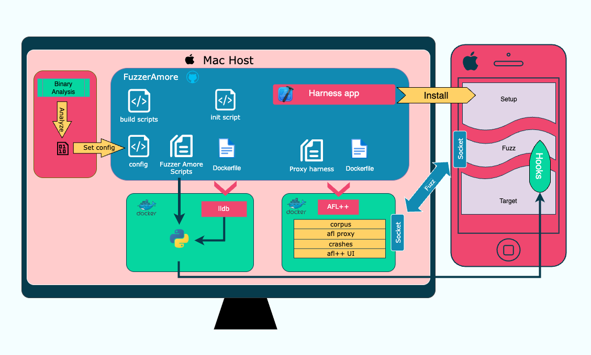
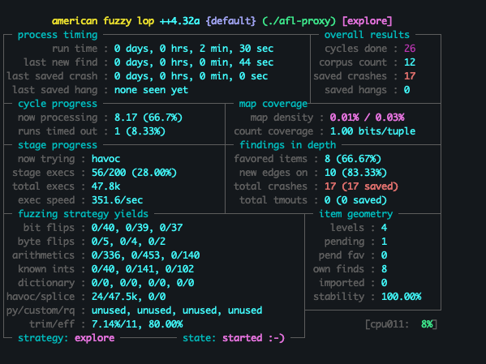

# Fuzzer Amore

An iOS-on-device-user-space-no-jailbreak-no-source-code-instrumented-afl++-based fuzzer

breakdown:
- Runs on a physical iOS device
- Jailbreak is not needed - can run on the latest iOS and beta versions
- Can run on user space apps/system-libraries/3rd party dylibs that are part of your process
- Instrumented / Coverage based
- Powered by AFL++ (proxy mode)




What it *can't* be used for (on a non jailbroken device):
- system daemons
- kernel  

(thumb rule: binaries that are not part of your process)

# Concept
Read the [blog post](https://chensokolovsky.github.io/FuzzerAmoreBlog/posts/FuzzerAmore.html)   
See [FAQ](#faq) section


# Acknowledgment
The inspiration for the project, plus integrating with AFL++, is based on the wonderful [fpicker](https://github.com/ttdennis/fpicker) work by Dennis Heinze, and his accompanying [blog post](https://insinuator.net/2021/03/fpicker-fuzzing-with-frida/)  


# Technicalities
## Strategy
LLDB can debug a process on the jailed device (since we own the process), and change its code at runtime, which means it can write hooks.
Nevertheless, breakpoints are very slow, much slower than Frida hooks, for example.
Yet, it is possible to connect to the process with LLDB, set up instrumentation instructions, and detach from the process, leaving the hooks in place without the debugger attached, until the next time it terminates and relaunches.
This way, the fuzzer can start sending its inputs only when the instrumentation (the hooks) is in place and lldb is out of the way, avoiding the performance drawbacks.

## Harness
There are two of them. The first one is the C harness which acts as the proxy process between AFL and the iOS harness.  
The second is the a C/ObjC iOS app, which listens to a port and receives instructions from the AFL++ proxy C harness via a TCP port (iProxy).  
The iOS harness also contains a dummy code function (named playground), allocated as an executable region, however its instructions will be replaced with new ones by LLDB.
Each code jump/branch from the fuzzed function, jumps to a dedicated address in the playground region, marks the coverage information, and upon exiting the function, reports all the coverage of that run to the C proxy.


## Instrumentation
Each command that ends a basic block is hooked for instrumentation. The term of a jump from the end of a block to another is an *edge*. When a certain input is finished, the fuzzer expects a report of the edges that this input covered (or some hash of the unique route), and using these reports AFL can plan strategies for the upcoming inputs.

The fuzzed function needs to run as if these hooks never happened, and so, after the edge is marked for coverage, the execution flow returns to its original branching decision.
This is done on a per-mnemonic basis, using the help of Capstone and Keystone.

There are two main categories of these mnemonics:   
A) TBNZ, TBZ, CBZ, CBNZ, which compare a bit/value to zero and jumps/skips   
B) B.XX which is placed after a CMP and branches according to the result and the condition   

Both categories can be handled the same way as the comparison value will not change after the branch command to the playground.
Logic of tbnz may maintain, as long as B.XX mnemonics are aware of not having operands other than the branching destination

More details in the dedicated [doc](./docs/command_handlers.md)

Note: the code can't handle switch cases and jump tables yet (or any jump that is not dichotomous). This is a TODO.


# Dockers
There are two containers

### LLDB container
This conatiner connects to the process using lldb, writes the hooks, and needs to be continued and detached after hooks are in place.
While lldb is most likely already installed on the host, the main reason for dockerizing this are the python dependencies, which give you the peace of mind that your host's python environment is not altered.

### AFL++ container 
The second one is the AFL++ with a proxy set to communicate with the app. This is based off the official afl++ docker.


# Prerequisites
MacOS   
Docker (Docker Desktop)   
Ability to build and run an iOS app on the real device (Xcode, Apple ID, physical iOS device with developer mode)   
iProxy and pymobiledevice3
USB cable
an iOS device


# compatibility
The project works for devices that run iOS 17 and above. The reason for this is the need to create a tunnel for starting the debugserver and connecting lldb to the device. Unfortunately, this requires a sudo command, which is prompted by the [host_setups.sh](./host_setups.sh) script. Alternatively you can avoid this (and the entire lldb docker) if you run the app via XCode, which creates the tunnel, runs the app, connects to a debugger for you, and then load the python scripts in the lldb console of XCode. Yet, this requires setting up the python dependencies on the host in the right place (the XCode lldb python may not be on the same path that your host's python3 is normally using).
The reason I chose to dockerize the lldb and not to use Xcode is mainly the ability to script and ship this process instead of needing to handle many hosts' Python setups that the tool may encounter

 
# Installing
```
$ git clone https://github.com/chensokolovsky/FuzzerAmore
$ cd FuzzerAmore
```

# Configuring
Configuration is done mainly in config.cfg in this repo.
There is no need to change port numbers, and iOS app name (harness)
Note that if you change the HARNESS_DEVICE_PORT it needs changing in the source code of the iOS harness as well

Configuring the fuzzed function is done inside ```lldb_docker>env>scripts>FAMainHelper.py```.
Change the reply value of these two functions according to your target.
```
def getFuzzedFunctionAddress():
    return getAddressOfSymbol("fuzzMeExample", "harness")

def getFuzzedFunctionLength():
    return 0x1c0
```
You could use the provided getAddressOfSymbol, or choose your own module+offset, or module+symbol combination to calculate the address.
The length function will set the end of the loop that reads the mnemonics that end basic blocks.
More info in the [configuration doc](./docs/configingAFuzzingTarget.md)

### Trampoline
If your fuzzing target is loaded more than ±128Mb away from the playground address, you will need to configure a trampoline address and a temp register. Read more in the [configuration doc](./docs/configingAFuzzingTarget.md)

# Running
Instructions:
```
// Run the app on the target device. then,
$ ./build_and_run_lldb_docker
Once hooks were written, continue and detach:
(lldb) c
(lldb) detach
(lldb) q
// you can also exit the lldb container
# exit
Then run the AFL++:
$ ./build_and_run_afl_docker
```

### Running with Xcode instead of the lldb docker
If you want to use XCode to set up the hooks (or debug the harness app for troubleshooting) , then instead of running the lldb docker do the following:
- open XCode, run the harness app on the device  
- Pause using the Xcode GUI (bottom left of the editor)  
- load the python script: 
``` 
(lldb) script import path/to/FuzzerAmore.py  
```
- You might need to install some libs on the host like keystone-engine and capstone  
To do that:  
```
$ pip3 install keystone-engine --break-system-packages
and in lldb, python might need help locating them, so do this:
$ python3 -m site
Look for the site-packages
and in lldb:
(lldb) script sys.path.append("/opt/homebrew/opt/python@3.13/Frameworks/Python.framework/Versions/3.13/lib/python3.13/site-packages")
or it might look like
(lldb) script sys.path.append("/opt/homebrew/lib/python3.9/site-packages")
and then this should work:
(lldb) command script import /path/to/fuzzer/amore/lldb_docker/env/scripts/FuzzerAmore.py
if it still doesn't, look for the path of the python executable
(lldb) script print(sys.path)
and then try to install directly from the python in the bin folder of the result in shell
$ /path/to/site/bin/python3.9 -m pip install keystone-engine
Then import it as above (sys.path.append)
```
   

# Initialization Scripts
When you run either of the ```./build_and_run*``` scripts, you are really doing the following:
- importing the configuration
- killing host tunnels and ports that may have been left open from the last time you ran
- creating the needed tunnels, port forwardings, and iproxy set ups for that container
- docker build
- docker run
- initializing a script inside the container to do its thing


⚠️ __Note__: when troubleshooting, these next sections are a must read. Each phase is usually depending on the previous one, and if it does not pass successfully, it will most probably cause some error down the line. 


### the lldb docker phase

The entry point to this phase is the ```./build_and_run_lldb_docker```   
It assumed that you [configured](#configuring) the needed fields, compiled, signed, installed, and launched the [ios harness](./harness) app 

The script runs an inner script named ```host_setups.sh```. The script runs on the host and it is responsible for the following:
- importing the configuration
- restarting the libmuxd port forwarding (ie, finding the existing forwarsing process using ```netstat```, killing it, and opening a new one using ```socat```)
- requesting sudo password for the next item
- restarting the tunnel from the host to the device (ie, finding & killing an existing one, and opening a new one. This requires sudo)
- extracting the tunnel information so the container can use it

The next step is running docker build and docker run, which installs all the needed libraries (once) and runs the container.   
Once the container starts, an [init](./lldb_docker/env/init) script performs the following inside the container:
- connecting the local unix socket to the host mux port
- get the PID of the ios harness from the device
- start debugserver on the device using the tunnel information from the previous steps
- get the connection information from the previous item
- set up lldb ready (patch + create lldbinit)
- start lldb and run the created lldbinit

The lldbinit imports the [FuzzerAmore.py](./lldb_docker/env/scripts/FuzzerAmore.py) which is the entry point the sets up the hooks

If the hooks were successfully applied, instructions to disconnect from lldb will appear in the log


### the AFL docker phase

Once the hooks are in place, and the debugger is detached, we can start running AFL++.
The entry point for this phase is the ```./build_and_run_afl_docker```   

The script starts by forwarding the container port to the device (via iproxy) port for communication between the C harness and the iOS harness.   
Then it runs iproxy to map the host port to the device port   
docker build and run install (once) and create the container, and initiating the container functionality

the AFL container [init](/afl_docker/env/init) is responsible for the following:
- Importing the configuration
- Compiling the c harness
- Setting up AFL folders and initial corpus
- Running the fuzzer in proxy mode

If everything is successful, you should see the AFL UI running 


# Performance
USB and iProxy performance is about 330-350 executions per second for a small scale function
     



# FAQ
(which always feels like I am interviewing myself)  

Q: How come it works on a non jailbroken device?   
A: You can use Xcode to run your app as a developer

Q: How does the instrumentation work without source code?   
A: Using lldb hooks, which you can use on your dev phone

Q: But lldb is very slow and a fuzzer should be fast   
A: lldb is slow when it is connected to the process, but FuzzerAmore places the hooks and disconnects lldb from the process, letting run free of tracing

Q: How fast?   
A: I tested with a classical [nested condition style](https://github.com/AFLplusplus/LibAFL/blob/4845ffebc8cf3fd757e46b2fa857d99279bb61f9/fuzzers/fuzz_anything/cargo_fuzz/src/lib.rs#L6) function  and got to ~350 executions per second

Q: What is generating the inputs?   
A: AFL++

Q: Is it generating them on the device?   
A: No. AFL runs on the Mac in a container

Q: How are the inputs make their way to the fuzzing target?   
A: The iOS harness opens up a socket and listens to the inputs, sent by the C harness, and the iOS harness returns the instrumentation result via socket to the C harness and to AFL++

Q: Does both devices need to be in the same LAN/Wifi?  
A: No, USB should do the trick. Ports are mapped by iproxy and/or unix ports (depending on the case) for a faster communication than over Wifi.

Q: How is this based on [fpicker](https://github.com/ttdennis/fpicker)?   
A: fpicker and the blog post helped me understand how to use AFL++ in proxy mode, and how to report the instrumentation results back to AFL++

Q: So why not just use fpicker? why create a new project?   
A: fpicker is Frida based and Frida needs a Jailbroken device. This project can theoretically run on the latest iOS and not depend on jailbreak.

Q: But Frida agent can be added to the app without jailbreak. can't that work?   
A: Yes it may, and this is something worth checking, yet data conversions may still introduce performance issues.

Q: Other reasons?  
A: When running fpicker on a real device (even a jailbroken device), it seemed that using this mode was not possible, as I encountered [this](https://github.com/ttdennis/fpicker/blob/40bc9ec58f83a340b90253b04e03a0bfb71e4261/fpicker.c#L143) error message.

Q: Instead of fuzzing system libraries on the device, why not just fuzz the same libraries on the Mac?   
A: iOS has some libraries that are not part of macOS, which you may want to test.


## Troubleshooting
See [troubleshooting](./docs/troubleshooting.md)


## Todos
I am not a fuzzing expert, and this setup is currently more of a POC than a heavily-tested tool. Would be very helpful if people with fuzzing experience can try it out, test different scenarios, and help it gain real-world testing for making improvements. Feedback is welcome.


## License
[apache 2.0](./LICENSE)

### tools/projects used:
AFL++ [license](https://github.com/AFLplusplus/AFLplusplus/blob/stable/LICENSE)   
lldb [license](https://github.com/llvm/llvm-project/blob/main/LICENSE.TXT)   
Docker [link](https://docs.docker.com/desktop/)   
XCode [link](https://developer.apple.com/xcode/)   
iProxy [license](https://github.com/tcurdt/iProxy/blob/master/LICENSE.txt)   
pymobiledevice3 [license](https://github.com/doronz88/pymobiledevice3/blob/master/LICENSE)   
usbmuxd licenses [1](https://github.com/libimobiledevice/usbmuxd/blob/master/COPYING.GPLv2),[2](https://github.com/libimobiledevice/usbmuxd/blob/master/COPYING.GPLv3)   
Capstone [licenses](https://github.com/capstone-engine/capstone/tree/next/LICENSES)   
Keystone [license](https://github.com/keystone-engine/keystone/blob/master/LICENSE-COM.TXT)   
opensshclient [license](https://github.com/openssh/openssh-portable/blob/master/LICENCE)   
cmake   
socat   
netstat   
